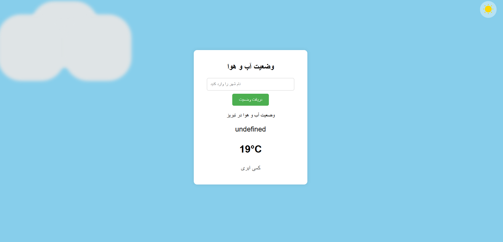

# 🌦️ اپلیکیشن نمایش آب‌ و هوا

این پروژه یک **اپلیکیشن ساده و کاربردی برای نمایش وضعیت آب‌وهوا** است. کاربر می‌تواند نام یک شهر را وارد کرده و اطلاعات لحظه‌ای مانند دما، رطوبت، سرعت باد و وضعیت آسمان را مشاهده کند.

---

## 📸 پیش‌نمایش



---


---

## 🔧 ویژگی‌ها

- جستجوی سریع و آسان وضعیت آب‌ و هوای شهرها
- نمایش:
  - دمای فعلی (درجه سانتی‌گراد)
  - وضعیت آسمان (ابری، صاف، بارانی و ...)
  - حالت شب و روز
- نمایش آیکون متناسب با وضعیت آب‌ و هوا
- طراحی دستی و با css خالص بک گراند
- طراحی زیبا و ریسپانسیو (مناسب برای موبایل و دسکتاپ)
- پیاده‌سازی با استفاده از API خارجی

---

## 🛠️ تکنولوژی‌های استفاده‌شده

- **OpenWeatherMap API**
- **JavaScript**
-  **HTML**
-  **CSS**

---

## ⚙️ نحوه نصب و اجرا

```bash
git clone https://github.com/mahdiJDS/weather-app.git
cd weather-app

```

---

## 📄 مجوز
این پروژه با مجوز MIT منتشر شده و استفاده از آن برای همه آزاد است.

---

## ارتباطات 

- [git hub](https://github.com/MahdiJDS)
- [mahdijahed56@gmail.com]

---